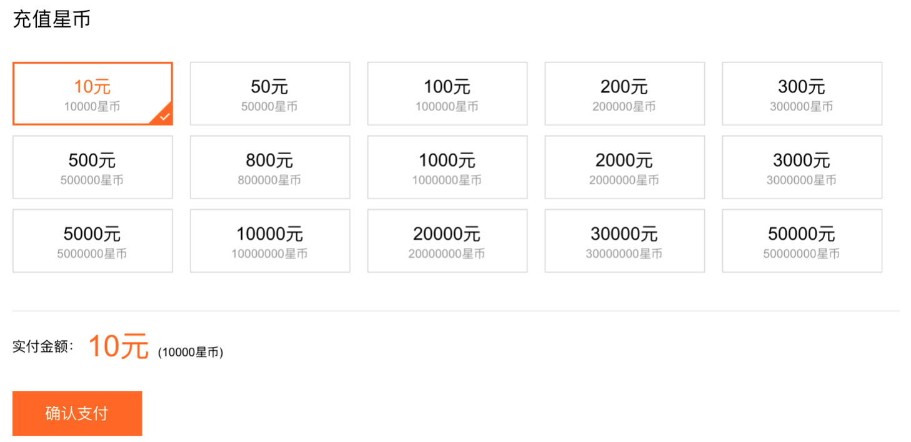
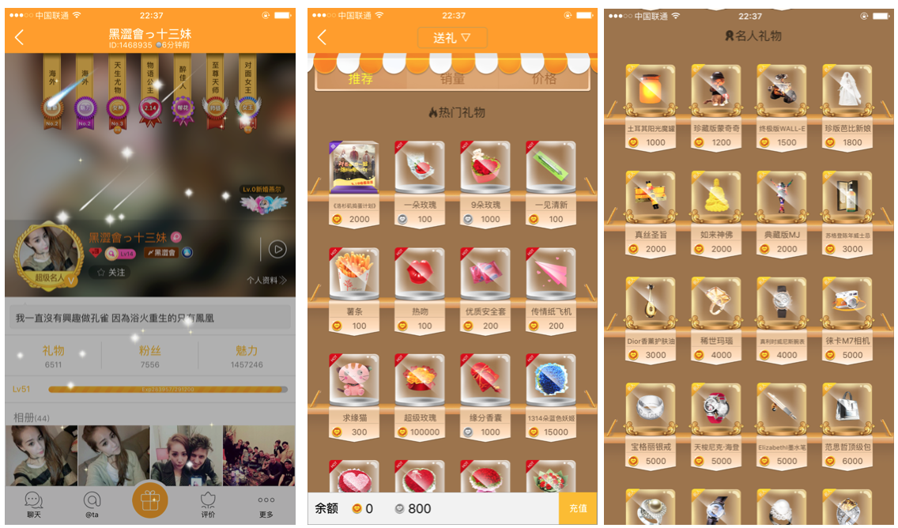

# GIFT系统说明书
(2016年2月12日)

<!-- toc -->

* [1. 系统简介](#1-系统简介)
  * [1.1 功能简介](#11-功能简介)
  * [1.2 系统故事划分](#12-系统故事划分)
* [2. 数据模型](#2-数据模型)
  * [2.1 DataBase](#21-database)
  * [2.2 JSON](#22-json)
* [3. 系统故事详细设计](#3-系统故事详细设计)
  * [3.1 用户可以购买VIP，查看自己的VIP信息](#31-用户可以购买vip查看自己的vip信息)
  * [3.2 VIP用户可以发送消息，查看等级对应的用户联系方式](#32-vip用户可以发送消息查看等级对应的用户联系方式)
  * [3.3 管理后台可以编辑VIP等级信息](#33-管理后台可以编辑vip等级信息)
  * [3.4 用户可以充值，查看自己的账户信息](#34-用户可以充值查看自己的账户信息)
  * [3.5 用户可以赠送VIP或者礼物给其他用户](#35-用户可以赠送vip或者礼物给其他用户)
  * [3.6 女神/男神列表](#36-女神男神列表)
  * [3.7 管理后台可以编辑或增加礼物列表](#37-管理后台可以编辑或增加礼物列表)
  * [3.8 用户可以选择成为其他用户的守护](#38-用户可以选择成为其他用户的守护)
  * [3.9 可以查看土豪列表](#39-可以查看土豪列表)
  * [3.10 可以查看收到的礼物列表和送出的礼物列表](#310-可以查看收到的礼物列表和送出的礼物列表)

<!-- toc stop -->

## 1. 系统简介

### 1.1 功能简介
    GIFT系统 是用来维护和展现在同城寂寞搭讪应用中的消费信息与用户活跃度信息。

>**支持的功能**

    参考其他APP，GIFT系统需要提供如下几个功能：
* 展现用户的受欢迎度。
* 展现用户消费的等级。
* 支持用户查看自己的受欢迎程度。
* 支持用户查看自己的消费等级。
* 支持VIP消费模式
* 支持送礼物

>**暂时不支持的功能**

    临时不能支持的功能，后续考虑增加支持：
* 暂不支持搜索
* 暂不支持认证

>**GIFT思路**

    交友APP不能局限于VIP消费，扩展消费有很多种模式。应该把VIP看作为消费环节中的一个组成部分。
    排行榜如下情景产生效果：

* 满足用户的虚荣心：无论是消费上榜还是受欢迎上榜，排行榜能让用户产生消费得到预期的效果，并能够持续消费下去。
* 无限制消费：VIP用户等级是有限制的，但是消费上榜和受欢迎上榜背后的消费则是可以进行排名的，同时也是没有限制的。

    GIFT系统需要针对以上两个主要点，进行前后端的设计，达到吸引用户的目的。

### 1.2 系统故事划分

>**Story**

    采用敏捷方法，GIFT系统采用多个故事来划分要完成的功能。如下用户角色和敏捷故事，将采用迭代开发方式，在开发过程中逐渐细化细节。

**故事角色**

* 普通用户：在注册后即成为该角色。
* VIP用户：可以通过APP进行购买，购买后附带一定的属性。
* 消费用户：在普通用户和VIP用户基础上进行进一步的消费，拥有一定的属性。
* 管理员：通过管理平台管理用户信息和排行榜信息。

**故事列表**

	以上述用户角色为例，存在如下用户故事：(优先级高数值大)

|No|描述|优先级|验证|
|:-- |:-- |:-- |:-- |
|1|用户可以购买VIP，查看自己的VIP信息|10|在个人中心购买后，自动刷新用户信息，自动转变为VIP用户。|
|2|VIP用户可以发送消息，查看等级对应的用户信息|10|购买一个VIP用户，可以马上和其他用户聊天，查看对应等级的用户信息。|
|3|管理后台可以编辑VIP等级信息|2|管理员可以在后台管理页面创建或者编辑VIP信息，并编辑对应的权限。|
|4|用户可以充值，查看自己的账户信息|9|用户在个人中心或者其他用户主页点击赠送按钮，可以进行充值，充值后自动刷新用户账户信息。|
|5|用户可以赠送VIP信息或者礼物给其他用户|8|用户在其他用户主页，可以点击赠送VIP或者赠送礼物，可以进行赠送，对应用户获得相关的VIP或者礼物。|
|6|用户受欢迎程度能够单独页面展现。|5|在APP中通过单独的“男神榜”、“女神榜”进行展现。|
|7|用户消费等级能够单独页面展现。|5|在APP中通过单独的“富豪榜”进行展现。|
|8|用户送出和收到的礼物列表能够单独查看。|5|在个人主页进行展现。|
|9|管理后台可以编辑或增加礼物列表|5|管理员可以在后台管理页面创建或者编辑礼物列表，并编辑对应属性。|
|10|用户可以选择成为其他用户的守护|4|用户在其他用户首页可以选择成为守护。每个用户最多有一定数量的守护，守护消费进行排序。|

>**系统分析**

**场景描述**

    GIFT系统用来支撑、维护、展示用户的社交和消费情况，社交和消费并存，并且在GIFT系统中需要交互体现。单独拿是否消费来区分，可以分为纯社交化排行榜和纯消费排行榜。

> 1.**纯社交的场景，主要包括自我展示和主动欣赏他人来进行更新系统的排行。**

    自我展示主要包括个人主页信息更改，例如对自己身体最满意的部位进行评论，自己对性的看法，另外系统也记录了有多少人看过自己和对自己心动。会对浏览个人主页的人产生一定影响。

    主动欣赏他人则会直接影响系统中的排行，例如对某个人心动，中意某个人，当某个人收到的心动数量很多，则会提升魅力值排行榜的排行。中意某个人，系统会记录下来，在对方状态更新的时候，会有提醒推送。因此需要多增加一个数据表来保存这部分数据：

**DB_TABLE: 心动数据**

|字段名|说明|
|:-- |:-- |
|userid|用户ID|
|admireid|心动对象ID|

> 2.**纯消费的场景，主要包括购买和赠送。来进行系统的排行更新。**

    对于纯消费的场景，购买的对象包括各种礼物、VIP、守护、特效等。购买力会直接影响富豪排行榜排行。

**礼物描述**

    单纯对于礼物来讲，只有在赠送的时候发生购买行为（消费金币），金币价格不区分普通会员和VIP，唯一有区别的地方在于购买金币（apple购买行为）有差别，VIP花费同样的费用可以购买更多金币。不过对于礼物来讲，可以考虑到带有的属性有：

|属性|说明|
|:-- |:-- |
|type|礼物的类型：普通礼物、特惠、特殊礼物、免费礼物|
|name|礼物的名称|
|description|详细说明|
|validnumber|库存数量|
|image_url|礼物的图片地址|
|effect|礼物的特效，赠送(收到)礼物有的会有特效|
|price|金币价格（1元=1000金币），一般不会变动|
|original price|礼物原价，对于特惠、VIP折扣、免费的礼物会有此项|

    对于VIP用户来讲，目前VIP等级无法在聊天个数和发送心动消息中区分出来，则需要在其他地方进行区分，一个是个人主页中可以查看联系方式，另外一个在充值中要进行区分。VIP会员在购买金币的时候，会有更多赠送（VIP和礼物无法进行折扣购买，只能按照金币价格购买）。可以考虑让VIP等级和赠送的百分比进行绑定：

|VIP等级|金币赠送百分比|
|:-- |:-- |
|普通会员|无赠送|
|level 1|无赠送|
|level 2|10%|
|level 3|30%|

    无论普通会员还是VIP会员，购买力排行榜的排行体现在赠送VIP和礼物上面，不进行赠送礼物则不会影响排行。也就是说，会员自己充值购买了多少金币只是一个个人属性，只有赠送出了礼物才会影响排行。因此考虑到这里，每个人的个人属性中要多出金币数量、送出礼物、收到的礼物三部分的数据:

**DB_TABLE: 个人消费表**

|字段名|说明|
|:-- |:-- |
|userid|用户ID|
|gold bean|持有的金币数量|
|consumend bean|消费的金币数量|

**DB_TABLE: 赠送礼物记录**

|字段名|说明|
|:-- |:-- |
|userid|用户ID|
|to_userid|赠送对象的ID|
|gift_id|礼物ID|
|gift_number|礼物的数量|
|timeUTC|赠送礼物的时间|

**守护描述**

    考虑一下守护系统，参考其他APP，守护可以设置一个或者多个，我们目前可以只设置一个。
    守护也可以定价，并且随着不同情境下，价格不同。例如，用户名下守护为空，此时可以用初始守护价格购买。如果已经有守护存在，那么需要花费更高的价格（比上一次要更高）来抢占。

    我们可以设置如下规则：
    1.守护价格可以设置为固定值，包括守护价格和持续时间。守护价格单位为金币，持续时间的单位为天。
    2.另外单独拿一个表，存储用户之间的守护情况。

**DB_TABLE: 守护表**

|字段名|说明|
|:-- |:-- |
|userid|用户ID|
|guardid|守护人ID|
|starttime|起始时间|
|cost|花费的金币数量|
|keeptime|持续时间(days)|

    3.如果要抢占对方的守护，则需要出已有价格更高的价格，临时方案是：
    普通用户最少＋1就可以被踢掉，钻石用户需要最少双倍才能被踢掉，至尊用户需要至少5倍才能被踢掉。

## 2. 数据模型
### 2.1 DataBase

    按照以上的分析，我们尽量不修改原用户表格，更多的是增加表格：

> 1.用户属性表修改：

```sql
ALTER TABLE `bh_db`.`girls` 
ADD COLUMN `bestpart` VARCHAR(100) NOT NULL AFTER `allow_kidstatus`,
ADD COLUMN `view_of_sex` VARCHAR(45) NOT NULL AFTER `bestpart`;

ALTER TABLE `bh_db`.`guys` 
ADD COLUMN `bestpart` VARCHAR(100) NOT NULL AFTER `allow_kidstatus`,
ADD COLUMN `view_of_sex` VARCHAR(45) NOT NULL AFTER `bestpart`;
```

> 2.心动表：

```sql
CREATE TABLE `bh_db`.`admire` (
  `id` INT NOT NULL AUTO_INCREMENT,
  `fromid` INT NOT NULL,
  `toid` INT NOT NULL,
  PRIMARY KEY (`id`),
  UNIQUE INDEX `id_UNIQUE` (`id` ASC));
```

> 3.VIP价格表：

    暂时由后台返回固定格式化数据，参考API (/vip/price)。

> 4.VIP赠送百分比：

    和VIP等级一样，采用固定格式JSON串返回。

> 5.礼物表：

```sql
CREATE TABLE `bh_db`.`gift` (
  `id` INT NOT NULL AUTO_INCREMENT,
  `type` INT NOT NULL,
  `name` VARCHAR(45) NOT NULL,
  `description` VARCHAR(100) NOT NULL,
  `validnum` INT NOT NULL,
  `imageurl` VARCHAR(256) NOT NULL,
  `effect` INT NOT NULL,
  `price` INT NOT NULL,
  `origin_price` INT NOT NULL,
  `discount_desciption` VARCHAR(100) NOT NULL,
  PRIMARY KEY (`id`),
  UNIQUE INDEX `id_UNIQUE` (`id` ASC));
```

> 6.用户持有和消费的金币表：

```sql
CREATE TABLE `bh_db`.`wealth` (
  `id` INT NOT NULL,
  `beans` INT NOT NULL,
  `consumend` INT NOT NULL,
  PRIMARY KEY (`id`),
  UNIQUE INDEX `id_UNIQUE` (`id` ASC));
```

> 7.礼物赠送表：

```sql
CREATE TABLE `bh_db`.`giftconsume` (
  `id` INT NOT NULL AUTO_INCREMENT,
  `fromid` INT NOT NULL,
  `toid` INT NOT NULL,
  `giftid` INT NOT NULL,
  `giftnum` INT NOT NULL,
  `time` BIGINT(20) NOT NULL,
  `message` VARCHAR(100) NOT NULL,
  PRIMARY KEY (`id`),
  UNIQUE INDEX `id_UNIQUE` (`id` ASC));
```

> 8.守护价格表：

    暂时由后台返回固定格式化信息，API参考后续文档。

> 9.守护表：

```sql
CREATE TABLE `bh_db`.`guard` (
  `id` INT NOT NULL AUTO_INCREMENT,
  `userid` INT NOT NULL,
  `guardid` INT NOT NULL,
  `starttime` BIGINT(20) NOT NULL,
  `keepdays` INT NOT NULL,
  `cost` INT NOT NULL,
  PRIMARY KEY (`id`),
  UNIQUE INDEX `id_UNIQUE` (`id` ASC));
```

### 2.2 JSON

    APP和后台Daemon之间交互，一般类似如下：

```text
APP                                  Daemon
+———————————  REST API  ———————————>——+
									  |
|—<——————————   JSON    ——————————————+
```

    相关 API 和 JSON 定义，参考后续的故事细化分解部分。


## 3. 系统故事详细设计
### 3.1 用户可以购买VIP，查看自己的VIP信息

**流程（工作流、数据流）详述**

    已有流程目前可以暂不修改。

**前端设计**

    暂不修改。

**接口设计**

    购买VIP:

**`[GET] /User/BuyVIP`**

*（输入）

|参数|说明|
|:-- |:-- |
|id|用户ID|
|password|用户密码|
|level|购买的VIP等级|
|days|购买的VIP时长|

*（存储/处理）

	1.daemon更新用户信息，发送购买VIP成功信息，并返回更新后的用户信息json结构。
	2.daemon将用户添加到VIP监视列表中，提前一天提示到期，到期后发送到期提示。

*（输出）

	返回用户信息json结构给APP端。

### 3.2 VIP用户可以发送消息，查看等级对应的用户联系方式

**流程（工作流、数据流）详述**

    VIP用户可以查看更多的用户信息，包括联系方式等（目前没有）。可以在VIP期间无限发送消息。因此需要修改后台返回的用户信息Json结构，对于VIP用户，返回更多字段。

**前端设计**

    前端无感知，只是解析用户Json结构即可，只不过非VIP用户字段更少。

**接口设计**

    不修改。

### 3.3 管理后台可以编辑VIP等级信息

**流程（工作流、数据流）详述**

    管理页面增加一个VIP等级编辑页面，对于虚拟用户，手动编辑VIP信息。

**前端设计**

    无

**接口设计**

    无

### 3.4 用户可以充值，查看自己的账户信息

**流程（工作流、数据流）详述**

    用户充值可以购买金币，目前暂定1元=1000金币。在用户属性页面进行购买。需要额外弹出一个页面，参考来疯平台，购买方式可以类似如下，用户可以选择充值:



**前端设计**

    在个人属性页面添加充值按钮或者购买金币按钮，用户进入购买页面调用购买接口。

**接口设计**

    购买金币：

**`[GET] /User/BuyBeans`**

*（输入）

|参数|说明|
|:-- |:-- |
|id|用户ID|
|password|用户密码|
|beans|购买的金币数量|

*（存储/处理）

	1.daemon更新用户信息，发送购买成功信息。
	2.返回更新后的用户信息json结构，这里用户信息需要增加一个金币数量，好在页面进行显示或更新。

*（输出）

	返回用户信息json结构给APP端。对于 PersonInfo 结构体，需要增加一个金币数量字段：

```go
/*
 * Infomation shows to the clients
 */
type PersonInfo struct {
    …
    GoldBeans int	//用户的金币数量
    …
}
```

### 3.5 用户可以赠送VIP或者礼物给其他用户

**流程（工作流、数据流）详述**

    首先我们需要考虑一下，用户赠送VIP需要直接进行消费（apple购买），赠送礼物则消费虚拟的金币。因此：

    1.赠送VIP走原有购买流程，不过购买成功后要通过额外的接口来通知后台赠送VIP成功。
    2.在进行礼物购买之前首先要确定用户金币是否足够，因此要首先获取个人金币数量以及礼物价格，这个需要预先从后台加载信息到前台。个人金币数量在个人信息中有，礼物价格需要通过额外API进行批量获取。

**前端设计**

    1.用户在浏览其他人的页面过程中，可以选择赠送礼物，礼物信息可以通过API获取信息列表。展现页面可以参考其他APP。



    2.用户在浏览其他人的页面过程中，可以选择赠送VIP。

**接口设计**

> 1.获取礼物信息

**`[GET] /Present/PresentList`**

*（输入）
	无

*（存储/处理）

	返回礼物信息。

*（输出）

	返回礼物信息给客户端，JSON字符串包含完整的礼物信息，不过用户在购买的时候，客户端能够根据VIP等级计算其实际消耗金币数量：

```go
type giftInfo struct {
	Id int //礼物固定id
	/* 礼物类型：
	 * 0 免费
	 * 1 普通礼物
	 * 2 折扣礼物
	 * 3 名人礼物
	 * ...
	 */
	Type                int
	Name                string //礼物名称
    ValidNum            int    //库存数量
	Description         string //礼物描述
	ImageUrl            string //礼物图片URL
	Effect              int    //礼物特效，需要客户端支持
	Price               int    //价格(beans)
	OriginPrice         int    //原价(beans)，对于折扣礼物和Price不同
	DiscountDescription string //折扣描述信息，对折扣作说明
}
```

> 2.赠送礼物：

**`[GET] /Present/PresentGift`**

*（输入）

|参数|说明|
|:-- |:-- |
|id|用户ID|
|password|用户密码|
|toid|被赠送用户ID|
|giftid|赠送的礼物ID|
|num|赠送礼物的数量|
|message|留言|

*（存储/处理）

	1.daemon更新赠送礼物的数据表，更新用户金币数量，返回更新后的用户信息。
	2.发送赠送成功信息给用户，发送赠送礼物信息给被赠送礼物的用户。

*（输出）

	返回赠送礼物成功消息。

> 3.赠送VIP：

**`[GET] /Present/PresentVIP`**

*（输入）

|参数|说明|
|:-- |:-- |
|id|用户ID|
|password|用户密码|
|toid|被赠送用户ID|
|level|赠送的VIP等级|
|days|赠送的VIP天数|

*（存储/处理）

	1.daemon更新被赠送用户的VIP等级，返回消费成功给用户。
	2.更新用户消费信息，发送赠送消息给被赠送用户。
	3.daemon将被赠送用户添加到VIP监视列表中，提前一天提示到期，到期后发送到期提示。

*（输出）

	返回赠送VIP成功消息。

### 3.6 女神/男神列表

**流程（工作流、数据流）详述**

    用户受欢迎程度，目前只考虑心动数量排名。用户可以心仪某个用户（在目前的发送心动信息基础上添加心动记录），也可取消对某个用户的心动，因此在客户端返回的用户信息中，还要添加一个额外的字段表示是否为心仪对象。

```go
/*
 * Infomation shows to the clients
 */
type PersonInfo struct {
    …
    IsAdmire bool  //是否为心仪对象
    …
}
```

    另外后台需要根据用户心仪对象的动作，推送不同的内容，这个也要增加后台页面支持。

**前端设计**

    1.在用户信息页面，增加一个心仪按钮（或者沿用目前的发送心动消息按钮）。
    2.增加一个查看魅力值排行榜页面。

**接口设计**

> 1.心仪/取消心仪：

**`[GET] /User/DoAdmire`**

*（输入）

|参数|说明|
|:-- |:-- |
|id|用户ID|
|password|用户密码|
|toid|心仪对象|
|type|1代表心仪；0代表取消心仪|

*（存储/处理）

	1.daemon修改心仪数据表，如果type为1，则发送心仪消息给心仪对象。
	2.daemon在心仪对象发送消息的时候，可以将推送消息头部修改为特定格式，例如：
		“你心仪的[XXX]给你发消息啦，快去看看吧”

*（输出）

	若type为1，发送心仪消息给心仪对象。


> 2.获取魅力值排行

**`[GET] /User/AdmireTopList`**

*（输入）

|参数|说明|
|:-- |:-- |
|id|用户ID|
|password|用户密码|

*（存储/处理）
	daemon将系统中用户按照”被守护价格X10 + 收到礼物总价值”的结果进行排序。

*（输出）

	魅力值JSON列表：

```go
type giftSndRcvInfo struct {
	GiftId      int //礼物id
	Number      int //礼物数量
}

type admireInfo struct {
	Person          personInfo	//用户信息
	AdmireCount     int         //被心仪的数量
	GuardCost       int         //被守护的价格
	GiftValue       int         //收到礼物的总价值
}
```

### 3.7 管理后台可以编辑或增加礼物列表

**流程（工作流、数据流）详述**

    后台需要添加和编辑礼物信息，包括：

* 新礼物上架，编辑礼物的属性：名称、描述、价格等等
* 礼物下架，后台需要仍旧保持礼物信息可以获取，保证前台能够查看下架礼物信息。

**前端设计**

    无

**接口设计**

    无

### 3.8 用户可以选择成为其他用户的守护

**流程（工作流、数据流）详述**

    这个流程可以简单的实现一下，用户要成为守护，基本上就两种场景：

* 被守护对象没有守护，可以直接购买守护。
* 被守护对象已经存在守护，需要通过更高的价格成为守护。

    在用户信息中需要增加3个字段：

```go
/*
 * Infomation shows to the clients
 */
type PersonInfo struct {
    …
    GuardId int       //目前守护，0代表无人守护
    CurGuardCost int  //目前守护价格
    …
}
```

**前端设计**

    在个人属性页面添加守护按钮，用户购买后调用/User/Guard接口。

**接口设计**

**`[GET] /User/DoGuard`**

*（输入）

|参数|说明|
|:-- |:-- |
|id|用户ID|
|password|用户密码|
|cost|花费的金币(beans)|
|keeptime|持续时间(days)|

*（存储/处理）

	1.daemon更新被守护用户信息，发送守护信息给被守护用户。
	2.如果之前已经被守护，则发送守护被替换消息给原守护。
	3.返回守护成功消息给用户。

*（输出）

	1.返回守护成功消息。
	2.发送被守护信息给被守护用户。
	3.发送守护被替换消息给愿守护。

### 3.9 可以查看土豪列表

**流程（工作流、数据流）详述**

    对于土豪的定义，不考虑充值多少和其VIP等级，参考的是通过赠送VIP与礼物消费过的人民币价值。每当用户消费后，前台调用赠送接口后，后台会自动刷新用户的消费记录，其中1元=1000金币。而随着用户消费的多少，我们需要对用户进行“加冕”，例如消费100元成为“小资”，消费1000元成为“大款”，消费10000元成为“土豪”等…

    所以首先，在用户信息中需要1个字段展现其“加冕”称号：

```go
/*
 * Infomation shows to the clients
 */
type PersonInfo struct {
    …
    RankName string //加冕后的称号,空字符串表示没有
    …
}
```

**前端设计**

    在前端单独有一个子页面可以查看土豪榜，可以参考“么么哒”。

**接口设计**

**`[GET] /User/WealthList`**

*（输入）

|参数|说明|
|:-- |:-- |
|id|用户ID|
|password|用户密码|

*（存储/处理）

	daemon返回系统中的土豪列表。

*（输出）

	返回土豪列表JSON字符串，参考personInfo。

### 3.10 可以查看收到的礼物列表和送出的礼物列表

**流程（工作流、数据流）详述**

    这个考虑放到用户信息中。所以首先，在用户信息中需要添加两个数组用来展示送出和收到的礼物：

```go
type giftSndRcvInfo struct {
	GiftId      int //礼物id
	Number      int //礼物数量
}

/*
 * Infomation shows to the clients
 */
type PersonInfo struct {
    …
    SndGiftList []giftSndRcvInfo //送出的礼物列表
    RcvGiftList []giftSndRcvInfo //收到的礼物列表
    …
}
```

**前端设计**

    在个人空间页面要有地方显示收到和送出的礼物列表。

**接口设计**

    personInfo中存放送出和收到的礼物列表，无需新接口。
